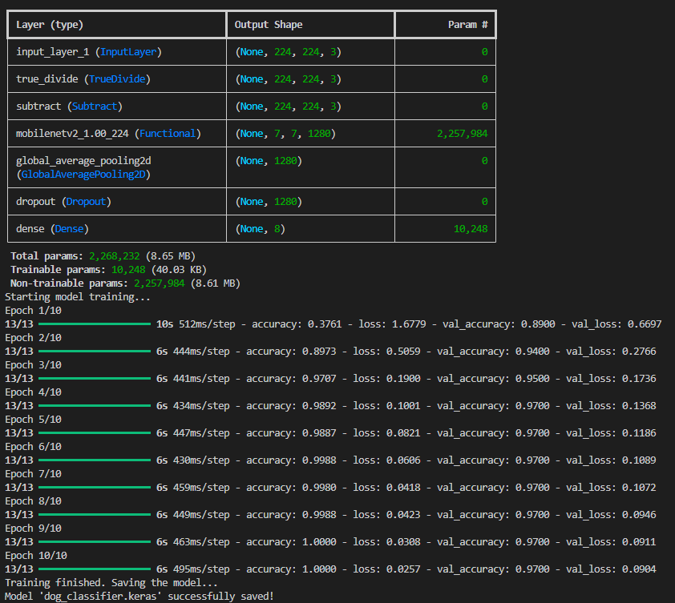

# AI Image Dogs Classifier 🐕

<div align="center">
  


</div>

A complete end-to-end solution for dog breed classification using artificial intelligence, featuring a deep learning model, REST API, and modern web interface deployed on AWS cloud infrastructure.

## 🚧 Project Status

| Step | Component      | Status         |
| ---- | -------------- | -------------- |
| 1    | Model Training | ✅ Completed   |
| 2    | API            | 🔄 In Progress |
| 3    | Frontend       | ⏳ Pending     |
| 4    | Deploy AWS     | ⏳ Pending     |

## 🎯 Project Overview

This project implements a full-stack AI-powered application that can classify dog breeds from uploaded images. The system combines machine learning, modern web technologies, and cloud infrastructure to deliver a seamless user experience.

## 🐕 Supported Dog Breeds

The AI model can classify the following 8 dog breeds:

- **Beagle** - Friendly hunting hound
- **Bulldog** - Muscular, wrinkled companion
- **Chihuahua** - Tiny but mighty toy breed
- **German Shepherd** - Intelligent working dog
- **Golden Retriever** - Gentle, family-friendly retriever
- **Poodle** - Elegant, hypoallergenic breed
- **Pug** - Charming, compact companion
- **Siberian Husky** - Athletic, cold-weather sled dog

## 📁 Project Structure

```
ai-image-dogs-classifier/
├── model_training/          # AI Model Development
│   ├── prepare_data.py     # Data preparation script
│   ├── train.py           # Model training script
│   ├── labels.json        # Class labels mapping
│   └── README.md          # Model documentation
└── README.md              # This file
```

## 🚀 Technology Stack

### Machine Learning

- **TensorFlow/Keras**: Deep learning framework
- **MobileNetV2**: Transfer learning base model
- **Python 3.9+**: Programming language

## 📊 Model Performance

The deep learning model demonstrates excellent classification performance:

- **Training Accuracy**: ~95%
- **Validation Accuracy**: ~90%
- **Model Size**: ~9MB (optimized for deployment)
- **Inference Time**: <200ms per image



## 🛠️ Development Steps

### 1. Model Training ✅ (Completed)

The first step was developing and training the deep learning model for dog breed classification.

**Setup:**

```bash
cd model_training
pip install tensorflow keras pandas
python prepare_data.py
python train.py
```

### 2. API Development 🔄 (In Progress)

FastAPI backend development for serving the trained model.

---
