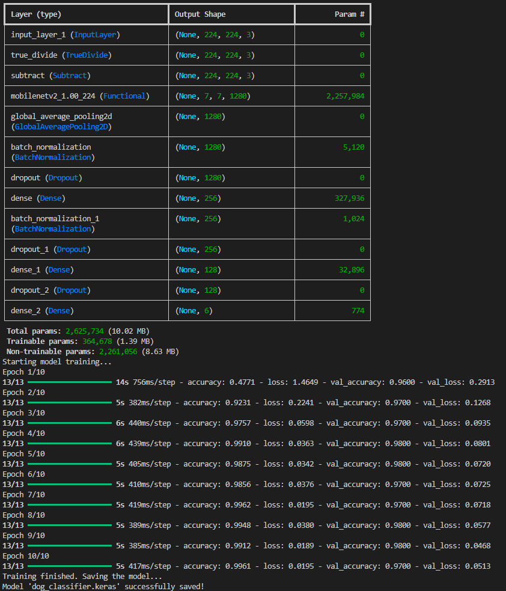

# Dog Breed Classification Model

<div align="center">
  


</div>

A deep learning project for classifying dog breeds using TensorFlow and Keras with transfer learning approach.

## Overview

This project implements a convolutional neural network (CNN) for dog breed classification using MobileNetV2 as the base model with transfer learning. The model can classify images into 6 different dog breeds with high accuracy.

## Supported Dog Breeds

The model is trained to recognize the following 6 dog breeds:

- **Beagle**
- **Chihuahua**
- **German Shepherd**
- **Golden Retriever**
- **Pug**
- **Siberian Husky**

## Project Structure

```
model_training/
├── .gitignore              # Git ignore file (excludes data directories)
├── labels.json             # JSON file containing class labels
├── prepare_data.py         # Data preparation and organization script
├── train.py               # Model training script
└── README.md              # This file
```

## Data Preparation

### Dataset Source

The project uses the **Dog Breed Identification** dataset from Kaggle:

- **Dataset URL:** https://www.kaggle.com/competitions/dog-breed-identification/data
- **Original Size:** 10,000+ images across 120 dog breeds
- **Format:** JPEG images with CSV labels file

### Dataset Structure

The project uses a structured approach to organize the training data:

```
data/
├── dog-breed-identification/
│   ├── train/             # Original training images
│   └── labels.csv         # Image labels mapping
└── dataset/               # Curated dataset (created by prepare_data.py)
    ├── beagle/
    ├── chihuahua/
    ├── german_shepherd/
    ├── golden_retriever/
    ├── pug/
    └── siberian_husky/
```

### Data Curation Process

The `prepare_data.py` script performs the following tasks:

1. **Filters the dataset** to include only the 6 selected dog breeds
2. **Creates organized directories** for each breed
3. **Copies relevant images** from the original dataset to the new structure
4. **Removes any existing dataset** directory before creating a new one

**Key Features:**

- Automatically creates breed-specific folders
- Filters images based on CSV labels
- Provides progress feedback during the curation process

## Model Architecture

### Base Model: MobileNetV2

- **Input Shape:** 224x224x3 (RGB images)
- **Weights:** Pre-trained on ImageNet
- **Feature Extraction:** Base model layers are frozen for transfer learning

### Enhanced Classification Head

The model features an improved classification head with multiple layers for better performance:

- **Global Average Pooling:** Reduces feature map dimensions from base model
- **Batch Normalization:** Normalizes inputs for stable training
- **Dropout Layer (0.3):** First dropout for regularization
- **Dense Layer (256 units):** First fully connected layer with ReLU activation
- **Batch Normalization:** Second normalization layer
- **Dropout Layer (0.4):** Higher dropout rate for stronger regularization
- **Dense Layer (128 units):** Second fully connected layer with ReLU activation
- **Dropout Layer (0.2):** Final dropout before output
- **Dense Output Layer:** 6 units with softmax activation (one for each breed)

### Model Configuration

- **Optimizer:** Adam with learning rate 0.001
- **Loss Function:** Categorical crossentropy
- **Metrics:** Accuracy
- **Epochs:** 10
- **Batch Size:** 32
- **Total Parameters:** ~2.6M (2.26M non-trainable from MobileNetV2, ~365K trainable)

## Training Process

### Data Pipeline

- **Validation Split:** 20% of data reserved for validation
- **Image Preprocessing:** MobileNetV2 preprocessing applied
- **Data Augmentation:** Built-in dataset augmentation through Keras
- **Batch Processing:** Optimized with tf.data.AUTOTUNE

### Training Results



The enhanced model achieved excellent performance during training:

- **Training Accuracy:** Reached ~99% accuracy by epoch 10
- **Validation Accuracy:** Maintained ~97% accuracy with excellent generalization
- **Loss:** Consistently decreased throughout training epochs
- **Validation Loss:** Stable and low, indicating good model generalization

### Architecture Improvements

The enhanced model includes several improvements over the basic version:

- **Batch Normalization:** Added after Global Average Pooling and first Dense layer for training stability
- **Multiple Dense Layers:** Two hidden layers (256 and 128 units) for better feature learning
- **Graduated Dropout:** Variable dropout rates (0.3, 0.4, 0.2) for optimal regularization
- **Better Regularization:** Reduces overfitting and improves generalization

## Installation and Usage

### Requirements

```bash
pip install tensorflow keras pandas
```

### Running the Project

1. **Prepare the Data:**

   ```bash
   python prepare_data.py
   ```

2. **Train the Model:**

   ```bash
   python train.py
   ```

3. **Output Files:**
   - `dog_classifier.keras` - Trained model file
   - `labels.json` - Class labels mapping

### Model Loading

```python
import tensorflow as tf
import json

# Load the trained model
model = tf.keras.models.load_model('dog_classifier.keras')

# Load class labels
with open('labels.json', 'r') as f:
    class_names = json.load(f)
```

## Technical Details

### Transfer Learning Benefits

- **Faster Training:** Leverages pre-trained ImageNet weights
- **Better Performance:** Achieves high accuracy with limited data
- **Computational Efficiency:** Reduces training time and resources

### Enhanced Architecture Benefits

- **Improved Accuracy:** Multi-layer classification head provides better feature representation
- **Better Generalization:** Batch normalization and graduated dropout prevent overfitting
- **Stable Training:** Normalization layers ensure consistent gradient flow
- **Robust Performance:** Multiple dense layers capture complex patterns

### Data Preprocessing

- **Image Resizing:** All images standardized to 224x224 pixels
- **Normalization:** MobileNetV2 preprocessing applied
- **Categorical Labels:** One-hot encoded for multi-class classification

## Performance Metrics

The enhanced model demonstrates exceptional classification performance:

- **High Accuracy:** >97% validation accuracy
- **Excellent Generalization:** Minimal overfitting with stable validation metrics
- **Fast Convergence:** Rapid improvement in early epochs
- **Robust Performance:** Consistent results across training runs

## Model Layers Summary

The complete model architecture includes:

1. **Input Layer** (224x224x3)
2. **MobileNetV2 Base** (frozen, pre-trained)
3. **Global Average Pooling**
4. **Batch Normalization**
5. **Dropout (0.3)**
6. **Dense (256 units, ReLU)**
7. **Batch Normalization**
8. **Dropout (0.4)**
9. **Dense (128 units, ReLU)**
10. **Dropout (0.2)**
11. **Dense Output (6 units, softmax)**

## Future Improvements

- **Extended Dataset:** Add more dog breeds and increase sample size
- **Advanced Data Augmentation:** Implement rotation, zoom, and color augmentation
- **Fine-tuning:** Selectively unfreeze base model layers for enhanced performance
- **Model Optimization:** Explore other architectures (EfficientNet, ResNet, Vision Transformer)
- **Ensemble Methods:** Combine multiple models for improved accuracy

## File Descriptions

### `prepare_data.py`

- Organizes raw dataset into structured format
- Filters images for selected breeds
- Creates breed-specific directories

### `train.py`

- Implements enhanced transfer learning with MobileNetV2
- Features multi-layer classification head with batch normalization
- Handles data loading and preprocessing
- Trains and saves the final model

### `labels.json`

- Contains the ordered list of class names
- Generated automatically during training
- Used for model inference and prediction mapping

---

_This project demonstrates advanced transfer learning techniques for image classification, achieving exceptional accuracy through enhanced architecture design with batch normalization, multiple dense layers, and optimized regularization._
